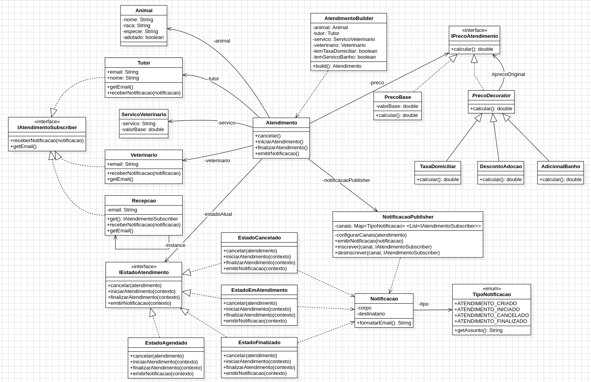
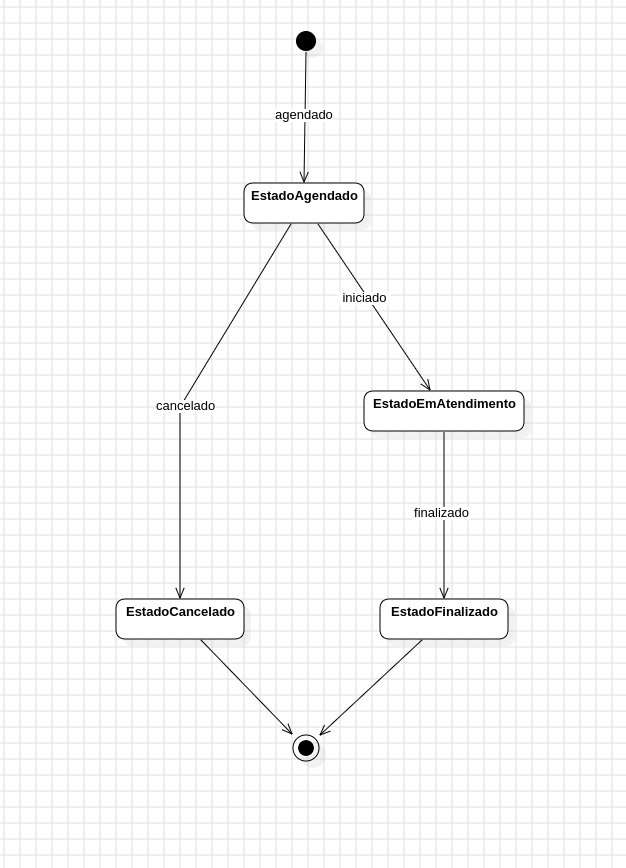

# LP5_Clinica_Veterinaria

Neste projeto, visamos implementar um sistema de uma clínica veterinária. Para tal, foi feito o uso de diversos padrões de projeto, de modo a cumprir o objetivo de forma limpa e abrindo espaço para expansão das funcionalidades.

## Diagrama de Classe

## Diagrama de Estados do Atendimento

